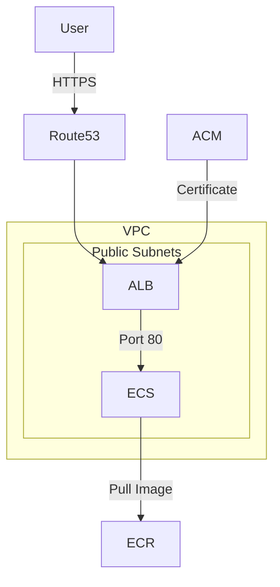

# ECS Project

This project deploys a containerised Flask application on AWS ECS Fargate, accessible via HTTPS through an Application Load Balancer. It uses Docker to containerise the app, Terraform to provision the AWS infrastructure, and GitHub Actions to automate builds and deployments.

## Architecture



## Project Structure

app/          # Flask application

infra/        # Terraform modules

.github/      # CI/CD pipelines

## Local Setup

```bash
cd app
python3 app.py
curl http://localhost:80/health
```

## Running with Docker

```bash
docker build -t myapp .
docker run -p 80:80 myapp
```

## Pipelines

- Build and Push — triggers on changes to app/
- Terraform Deploy — triggers on changes to infra/
- Terraform Destroy — manual trigger only
