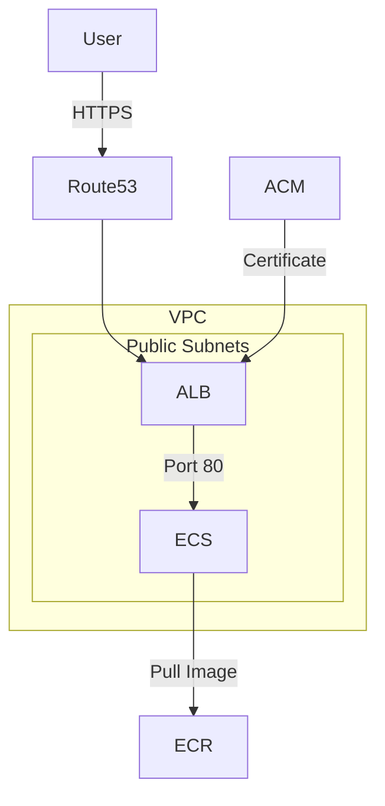

# ECS 

## What Does ECS Do?

This project deploys a containerised Flask application on AWS ECS Fargate, accessible via HTTPS through an Application Load Balancer. It uses Docker to containerise the app, Terraform to provision the AWS infrastructure, and GitHub Actions to automate builds and deployments.

## What Is ECS? 

A production-grade containerised application deployed on AWS ECS Fargate using Terraform modules, GitHub Actions CI/CD, and HTTPS on a custom domain.

## Why Do Engineers/Companies Use This?

Manually clicking through AWS consoles is deemed inefficient and it only takes one engineer in a team to make one mistake that can take down the whole production. Infrastructure as code means that every change will be reviewed, version controlled and most importantly it'll be reproducible which saves a lot of time. Using ECS Fargate means you don't personally manage any servers which allows you to type "run my container" and AWS will handle all the work. This is more efficient as it reduces the amount of code you would have to fix and monitor.

## Request Flow

User Browser (HTTPS)

│

▼

┌──────────────────┐

│    Route53       │  ← A record points to ALB

└────────┬─────────┘

│

▼

┌──────────────────┐

│      ALB         │  ← TLS termination via ACM

│  (myapp-alb-sg)  │  ← Allows inbound 80/443

└────────┬─────────┘

│

▼

┌──────────────────┐

│   ECS Fargate    │  ← Fargate, no EC2 to manage

│  (myapp-ecs-sg)  │  ← Only allows traffic from ALB

│   Flask App      │  ← Returns {"status":"ok"}

└──────────────────┘

│

▼

  ────────────────

│      ECR         │  ← Image pulled on task start

  ────────────────
  This is the process of what happens when you request the domain.

## Project Structure

```
.
├── app/
│   ├── app.py
│   ├── Dockerfile
│   └── requirements.txt
├── infra/
│   ├── main.tf
│   ├── provider.tf
│   ├── variables.tf
│   ├── outputs.tf
│   └── modules/
│       ├── vpc/
│       ├── ecs/
│       ├── alb/
│       ├── ecr/
│       └── acm/
├── .github/
│   └── workflows/
│       ├── app.yml
│       ├── terraform-deploy.yml
│       └── terraform-destroy.yml
└── README.md
```

## Architecture


| Category | Technology |
|----------|-----------|
| Cloud | AWS (ECS Fargate, ALB, VPC, Route53, ACM, ECR) |
| IaC | Terraform with modules |
| CI/CD | GitHub Actions with OIDC |
| Application | Python Flask, Docker |
| DNS | Namecheap → Route53 |
| Region | eu-west-2 (London) |

## Local Setup

```bash
cd app
python3 app.py
curl http://localhost:80/health
```

## Running with Docker

```bash
docker build -t myapp .
docker run -p 80:80 myapp
```

## Terraform State

Remote state is stored in S3 with versioning enabled:

- Bucket: `sudaysi-terraform-state`
- Key: `ecs-project/terraform.tfstate`
- Region: `eu-west-2`
- Versioning: Enabled

## Security

| Concern | Solution |
|---------|---------|
| No hardcoded credentials | Connecting the GitHub OIDC with your IAM role | 
| Network isolation | ECS tasks are only reachable via the ALB security group | 
| Encryption in transit | The encryption stops at the ALB using ACM certificate |
| State file security | I used an S3 bucket with the versioning enabled so every change is saved |

## Challenges

**ECR 403 on push** — ECR login tokens expire. Solution is to re-run `aws ecr get-login-password | docker login` before pushing.

**Terraform state not in CI** — GitHub Actions had no access to local tfstate, causing it to try recreating existing resources. Fixed by migrating state to S3 backend.

**691MB binary committed to git** — `.terraform/` folder was accidentally committed. Removed with `git filter-branch` and added to `.gitignore`.
## GitHub Actions

GitHub Actions is the key element here in automation. Every single time you push code it runs a series of steps automatically. For Example: building the docker image, pushing it to the ECR and running Terraform. Without GitHub Actions you would have to manually perform these steps every time you make a change. Using the OIDC part means GitHub proves its identity to AWS without having the burden of storing passwords and keys. AWS trusts GitHub completely

## Pipelines


The CI/CD pipeline succesfully showing it's passed all it's deployments; Build and Push to ECR, Terraform Deploy, Terraform Destroy


- Build and Push — triggers on changes to app/
- Terraform Deploy — triggers on changes to infra/
- Terraform Destroy — manual trigger only

## App Demo


Succesful image of my app running
The application is accessible at [https://tm.sudaysi.xyz/health](https://tm.sudaysi.xyz/health)

